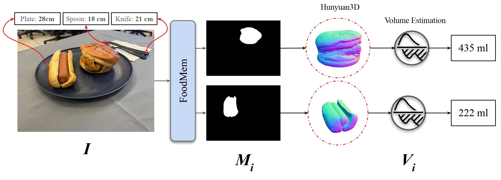

<div align="center">
  <h1>OneVol: One-shot Food Volume Estimation and 3D Reconstruction</h1>
  <p>
    <a href="https://www.linkedin.com/in/amughrabi/">Ahmad AlMughrabi*</a>, 
    <a href="https://www.linkedin.com/in/umair-haroon-8729611ab">Umair Haroon*</a>, 
    <a href="https://www.linkedin.com/in/ricardo-marques-a3128847/">Ricardo Marques* ¹</a>, 
    <a href="https://www.linkedin.com/in/petia-radeva-71651334/">Petia Radeva* ²</a>
  </p>
  <p>
    AIBA Lab @ <a href="https://web.ub.edu/web/ub/">UB</a> (Universitat de Barcelona)*,
    Computer Vision Center ¹,
    Institut de Neurosciències ²
  </p>
</div>

-----

<div align="center">
  <h2>Meta Food CVPR Workshop Challenge 2025: <a href="https://sites.google.com/view/cvpr-metafood-2025/challenges?authuser=0">3D Reconstruction From Monocular Multi-Food Images</a></h2>
</div>

<div align="center">
  <h2>We are the Runner-up of the Meta Food CVPR Workshop Challenge 2025!</h2>
</div>

We are thrilled to announce that our team has been awarded the **Runner-up** position in the prestigious Meta Food CVPR Workshop Challenge 2025! This recognition highlights our team's dedication, innovative methodologies, and commitment to advancing the field of food volume estimation and 3D reconstruction using computer vision.

-----

## Table of Contents

- [Introduction](#introduction)
- [Installation](#installation)
- [Methodology](#methodology)
- [Submodules](#submodules)
- [Results](#results)
- [License](#license)
- [Acknowledgements](#acknowledgements)

-----

## Introduction

The field of 3D reconstruction from monocular images is rapidly advancing, presenting exciting opportunities within food image analysis. The ability to generate 3D models of food from single 2D images of eating occasions, scaled to real-world physical units, holds the potential to revolutionize how users share culinary experiences and provides crucial data for tracking individual nutritional intake. However, the task of 3D food reconstruction poses significant challenges that serve as an excellent benchmark for evaluating the robustness and capabilities of contemporary computer vision algorithms.

### Challenges in Monocular Multi-Food 3D Reconstruction

- **Diversity of Food Items:** Real-world food images contain a wide array of colors, textures, shapes, and sizes.
- **Varying Reflective Properties:** Food surfaces can range from highly glossy (e.g., boiled eggs) to completely matte (e.g., yeast bread).
- **Complex Multi-Food Scenes:** When multiple food items are present, issues like occlusion, overlap, and shadows complicate the extraction of meaningful 3D information.
- **High Intra-Class Variability:** The same food dish can appear in numerous presentations, rendering methods relying on fixed 3D models or shapes insufficient.

### Evaluation

Our method will be evaluated based on the **shape accuracy** and the **portion size (volume) accuracy** of the reconstructed 3D food models. Following the protocol of the MetaFood 2025 challenge, we will assess volume using the Mean Absolute Percentage Error (MAPE) in Phase I. Top-performing teams will then be evaluated on shape accuracy using the L1 Chamfer Distance in Phase II, comparing our reconstructions against 3D scanned ground truth models. This two-phase evaluation aims to assess our 3D food reconstruction pipeline comprehensively.

### Our Framework




## Installation:

To get started, clone this repository:

```bash 
git clone https://github.com/GCVCG/OneVol-MetaFood.git

```

### Requirements

- ninja
- pybind11
- diffusers
- einops
- opencv-python
- numpy
- torch
- transformers
- torchvision
- trimesh
- pymeshlab
- pygltflib
- xatlas
- accelerate
- gradio
- fastapi
- uvicorn
- rembg
- onnxruntime

You can install the required packages using pip:

```bash
pip install -r requirements.txt
```

## Submodules

Please note that this project relies on several submodules that are not included in this repository. You must clone and install these submodules from their respective repositories:

1. [FoodMem](https://amughrabi.github.io/foodmem/)
      - Repository: [FoodMem](https://github.com/GCVCG/FoodMem.git)

2. [Hunyuan3D-2](https://3d-models.hunyuan.tencent.com/)
      - Repository: [Hunyuan3D-2](https://github.com/Tencent-Hunyuan/Hunyuan3D-2.git)

## Methodology

### Data:
We used the dataset provided by the MetaFood CVPR Workshop Challenge 2025. It comprises 14 food scenes with 34 food items categorized by difficulty.  

You can download the data from Kaggle: [3D Reconstruction From Monocular Multi-Food Images Dataset](https://www.kaggle.com/competitions/3d-reconstruction-from-monocular-multi-food-images/data)

### Evaluation

A two-phase evaluation process focuses on assessing the precision of reconstructed 3D models in terms of both shape (3D structure) and portion size (volume). Results will be compared against reference models of the same food items captured using a 3D scanner.

#### Phase-I (Portion Size Evaluation)

-   **Metric**: Mean Absolute Percentage Error (MAPE).
-   **Focus**: Accuracy of predicted food portion sizes (volume accuracy).
-   **Weight in Final Score**: 55%

#### Phase-II (Shape Evaluation)

-   **Eligibility**: Top-ranking teams from Phase-I (typically 3-5 teams, depending on total participation).
-   **Requirement**: Submission of complete 3D mesh files (`.obj`) for each food item.
-   **Metric**: L1 Chamfer Distance, following the protocol used in the DTU benchmark [1].
-   **Focus**: Accuracy of 3D shape reconstruction.
-   **Weight in Final Score**: 45%

The final winner will be determined by combining scores from both phases for all private food objects, with a weighted sum of the rankings from each phase.

## Results

### Phase-I
- MAPE: 0.31

### Phase-II
- Chamfer Distance With Transformation Matrix: 7.0716


## Acknowlegements
This work was partially funded by the EU project MUSAE (No. 01070421), 2021-SGR-01094 (AGAUR), Icrea Academia’2022 (Generalitat de Catalunya), Robo STEAM (2022-1-BG01-KA220-VET000089434, Erasmus+ EU), DeepSense (ACE053/22/000029, ACCIÓ), CERCA Programme/Generalitat de Catalunya, and Grants PID2022141566NB-I00 (IDEATE), PDC2022-133642-I00 (DeepFoodVol), and CNS2022-135480 (A-BMC) funded by MICIU/AEI/10.13039/501100 011033, by FEDER (UE), and by European Union NextGenerationEU/ PRTR. R. Marques acknowledges the support of the Serra Húnter Programme. A. AlMughrabi acknowledges the support of FPI Becas, MICINN, Spain. U. Haroon acknowledges the support of FI-SDUR Becas, MICINN, Spain.
    
